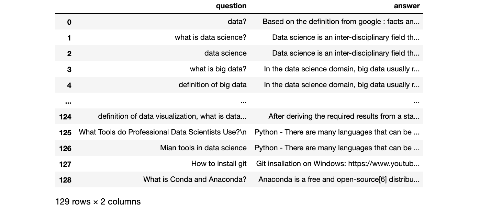
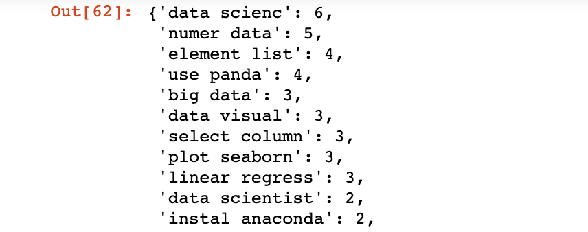
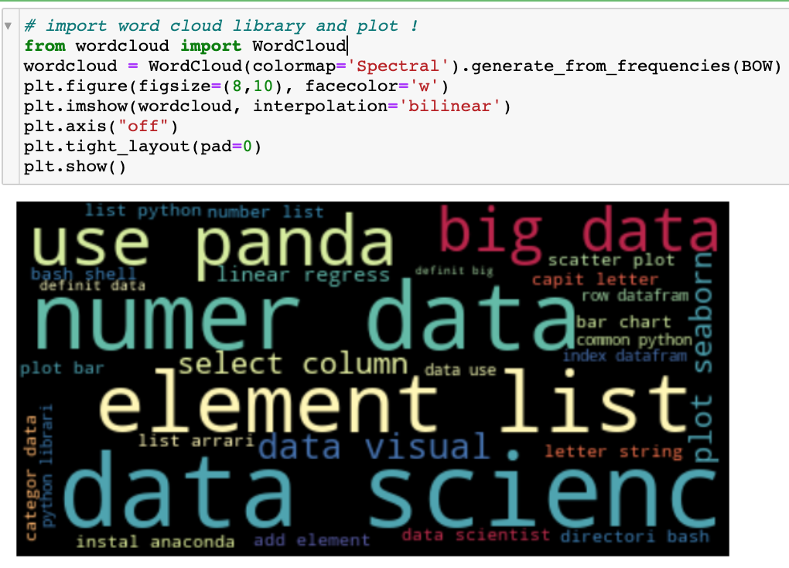
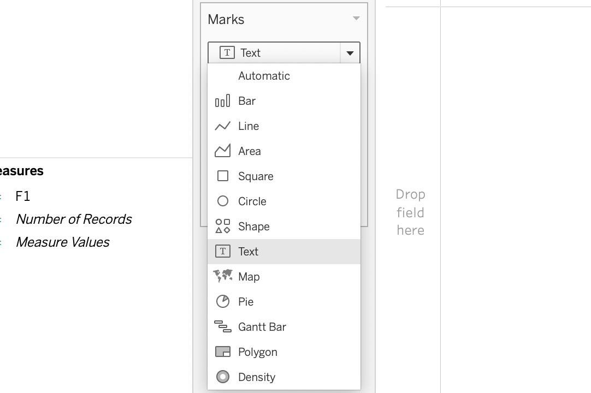
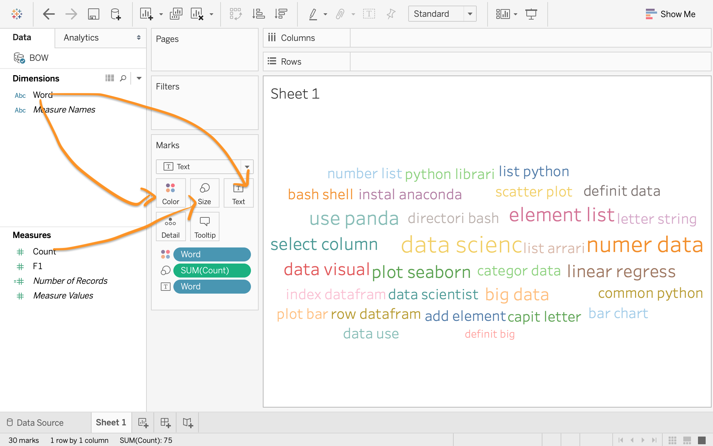
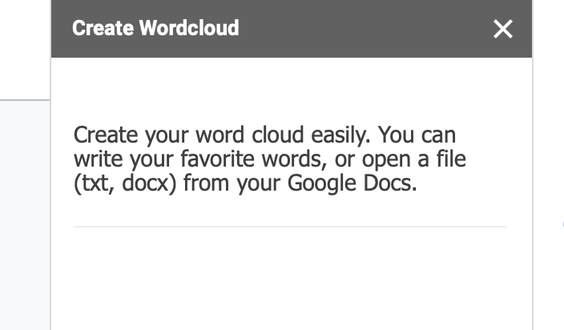
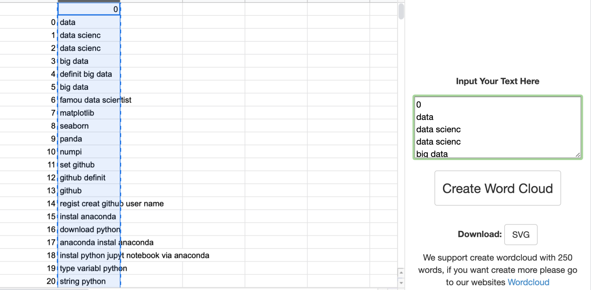
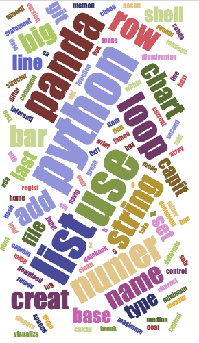
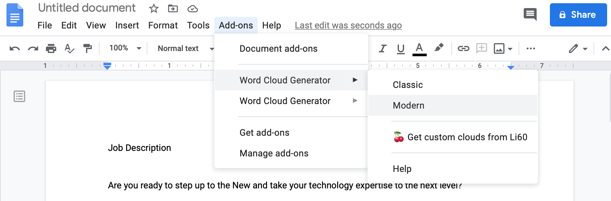
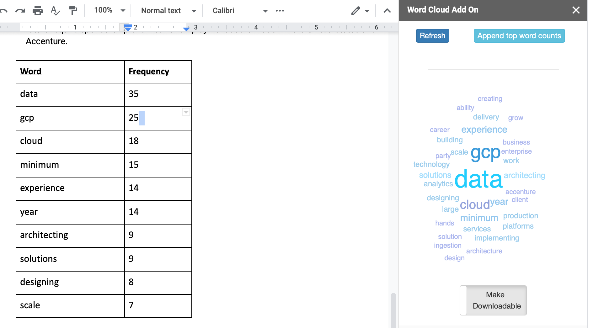

# Word Cloud using Tableau, Python, and Google Word Cloud Generator

Word Cloud is one of the data visualization tools for text data. One of my projects is to analyze the Amazon review data (the project link)and I applied Natural Language Processing and NLTK toolkits for text data in EDA (Exploratory Data Analysis) part. In this part, I figured out several ways to present and create a Word Cloud using different methods — Tableau, Python, and Google World Cloud Generator.

## Data and Data Preprocessing
I created this dataset myself and this dataset was a sample for my hard-coded chatbot project. If you are interested in my chatbot project please feel free to visit my [GitHub repo](https://github.com/melanieshi0120/AI_Chatbot_Project). Let us take look at the data. This table has two columns- question and answer. And we can see that this data contains some punctuation and signs. The first thing we need to do is to pre-process this text data.

After data pre-processing with NLP, we get a list like this- Bag of words (BOW) and save it as a CSV file.

## Python

Python is an “easy to use” programming language. I finished all the steps of data pre-processing using python. There is a library which is called wordcloud.
After we obtain the BOW, we can simply use wordcloud to plot a word cloud chart. Here is the python code for plotting word cloud and the bigger the words are, the higher frequency they are. For more details of code, please visit my [GitHub](https://github.com/melanieshi0120/word_cloud_methods/blob/main/word_cloud_for_text_data.ipynb)

## Tableau
- Tableau is one of the BI tools for data visualization. I like using Tableau to create dashboards because Tableau can offer very clear and fancy charts.

- After you load the BOW.csv with Tableau, you can see there will a sheet that Tableau automatically creates for you. Then you can click “Sheet 1” and continue the task. Before we start to create a word cloud you need to select Text First and then start to “dragging”.

- Then we can drag the “Word” column to “Text” and “Color”, then drag “Count” to “Size”. Here you go — we got a word cloud using Tableau!

## Google Word Cloud Generator
Google Word Cloud Generator is one of the free add-ons in Google Docs, Sheets, and many more. This function is very useful in different ways.

### 1. We can use this for data visualization — the world cloud.
This is function is very easy to use-
- First, go to your google drive and create a new sheet
- Click ‘Add-ons’ and then click “Get add-ons”
- Seach Word Cloud Generator and install it
- Then go to Add-ons, click Word Cloud Generator, and select insert word cloud. You can see this little window shows up. If you scroll to the bottom you can see “Input Your Text Here”

- Import merged_df.csv (for more details and information, please visit my )
- Copy the entire column and paste them into “Input Your Text Here” and click “Create Word Cloud”,

- Here you are -  a word cloud

### 2. We can prepare our interviews, and cover letters with Google Word Cloud Generator
Sometimes it is really time-consuming to read the job descriptions and to catch keywords. Here is a very good method for you.
- Open an empty Google Docs and click ‘Add-ons’ and then click “Get add-ons”, then search Word Cloud Generator and install “word cloud generator ” for Docs
- Then find an open position than you want to apply for, and copy & paste the job description to your Google Docs
- Then go to Add-ons, click Word Cloud Generator, and select Classic or Modern (!it depends on you, they are just two different styles).

- I selected the classic one and the little window will pop up like the image below and if you want to know what is the top ten (10) frequent words among this job description, you can simply click “Append top word counts”.

This is a pretty good and efficient way to capture keywords (requirement skills) from the job descriptions.
We can prepare some interview questions like
What can you bring to this role?
Why you are a good candidate?
What can your future teammates count on you for?
So you can talk about your experience in data acquisition, GCP, architecting.
## Conclusion
Word Cloud is commonly used in different territories, and we also can use it for our needs. Creativity is from life and the people you love.

